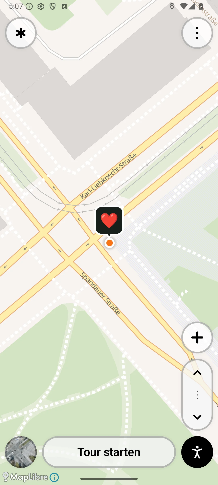
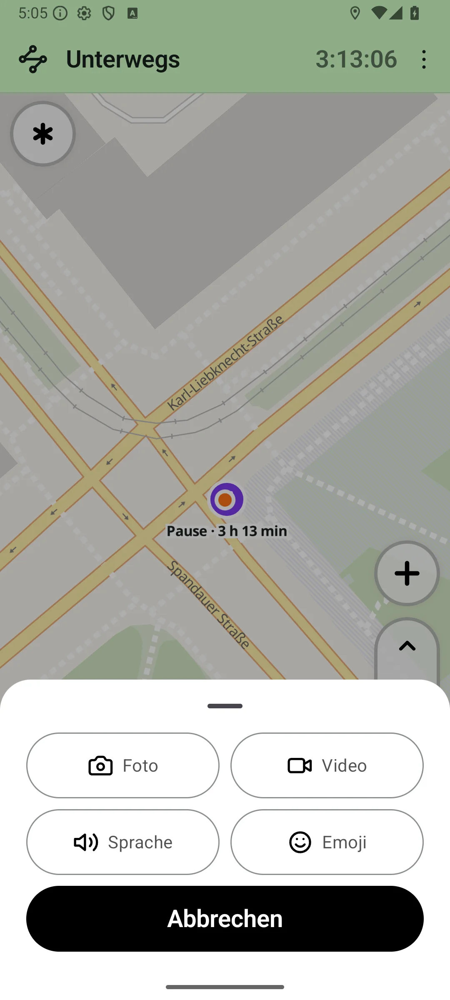
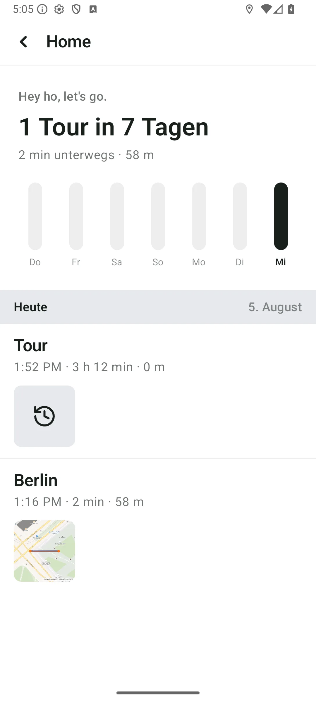

# Spur

**A personal map of the places you explore.** Record walks, see the streets
and paths you have covered, and leave photos, videos, voice notes, or emojis
along the way. Built for remembering a city, without turning every outing
into a workout or a social feed.

<p>
  
  
  
</p>

*Earlier demo captures from the landing-page branch. They show a public Berlin
location, not the author's home; the current interface may differ.*

## At a glance

- **Started:** July 23, 2026, by Arash Yalpani.
- **Status:** experimental native Android app, version 0.1.0.
- **Platform:** Android 8.0 or later; AR features depend on device support.
- **Local first:** tour history and recorded moments are stored on your device.
  No account is required.

## What you can do

Start a tour and keep recording with the screen locked. Add a photo, video,
voice recording, or emoji to a place. Revisit tours from Home, browse their
waypoints, and see your recent activity and accumulated street coverage.

Optional Home Zone automation can start and finish tours as you leave and
return. Back up tours and moments to a folder you choose through Android's
file providers. Experimental AR items let you place and discover objects
in the world.

## Privacy and connectivity

Your recorded tours and moments stay on the device unless you share them or
enable backups to a chosen destination. Map imagery, map tiles, and landmark
lookups use external services. The optional public-item feature exchanges item
locations with the [Spur Items Service](server/README.md); it is separate from
private tour recording. Local first does not mean every feature works offline.

## Built with

- **Kotlin, Jetpack Compose, and Material 3** for the native interface.
- **MapLibre and OpenStreetMap-based maps** for the map and route display.
- **Android location services and SQLite** for tracking and local tour storage.
- **CameraX** for photos and video; Android media APIs for voice moments.
- **ARCore and SceneView** for experimental AR items.
- **WorkManager and Android document providers** for backups.
- **Go and SQLite** for the optional public-item service.

## Try it

Open the project in Android Studio with JDK 17 and Android SDK 35 installed.
Let Gradle sync, then build and run the **app** module on an Android device.
Grant location access when prompted; background tracking and Home Zone
behaviour require the corresponding Android permissions. Camera and microphone
access are requested for the relevant moment types.

To build a debug APK from the command line, configure `ANDROID_HOME` or
`local.properties`, then run:

```sh
./gradlew assembleDebug
```

The APK is written to `app/build/outputs/apk/debug/app-debug.apk`.

## Development

Run the project's checks with:

```sh
./gradlew testDebugUnitTest assembleDebug lintDebug
```

GitHub runs a **Secret scan** on pushes and pull requests. To check locally
before pushing, install Gitleaks and run:

```sh
gitleaks git . --log-opts="--all --full-history" --redact=100 --ignore-gitleaks-allow
```

Local `.env` files, private keys, and signing keystores are ignored. Environment
example files must contain placeholders only. Ignore rules do not remove files
already committed, and the GitHub check runs after upload; it does not block a
push. Making `gitleaks` a required status check is a separate repository setting.

## More

[Product notes](PRODUCT.md) ·
[Architecture](docs/architecture.md) ·
[Backups](docs/backup.md) ·
[Maintenance notes](docs/main-activity-refactor.md) ·
[Change and verification rules](AGENTS.md)

See [third-party notices](THIRD_PARTY_NOTICES.md) for the Lucide icons and
Kenney models. No project-wide license has been added yet.
