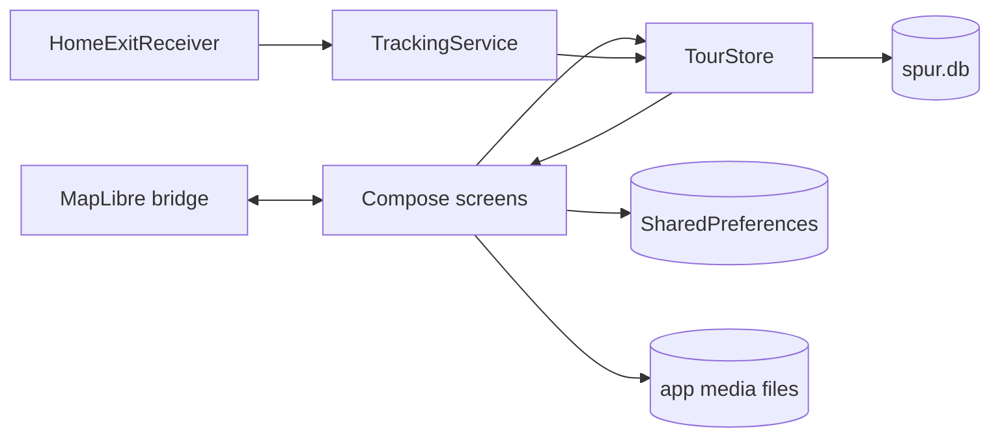

# Spur architecture

This document describes the TourEditor-v2 baseline merged to `main` in
`542c75c` and the component boundaries created by the MainActivity refactor.
It is intentionally descriptive: the refactor changes ownership and file
boundaries, not behavior or state architecture.

## Runtime components

| Component | Responsibility | State owner |
| --- | --- | --- |
| `MainActivity` | Android activity lifecycle, splash hand-off, Compose entry | Android |
| `SpurApp` | permission onboarding, navigation between map/history/editor/player | Compose |
| `MapPage` | map-screen coordination, active-tour and moment UI state | Compose + `TourStore` |
| `MapSurface` | MapLibre bridge, listeners, style installation, camera/follow updates | `MapView` + Compose bridge |
| `TrackingService` | foreground location updates for the active tour | Android service + `TourStore` |
| `TourStore` | tours and track-point persistence | SQLite |
| Moment/media components | composer, local files, playback, detail and share actions | Compose + app files |
| Home automation | home building/start point, geofence registration and exit receiver | SharedPreferences + Android geofencing |
| History/editor/player | reading, displaying, trimming and playing stored tours | Compose + `TourStore` |

Map overlay controls share `MapIconButton`. Its secondary variant swaps the
user-selected map-control foreground and background colors and uses the soft
2 dp outline from `secondaryMapControlStyle`, derived from the secondary font
color at 25% opacity. The map-style switcher and
inactive tour-start control use the same style. The location/follow control
remains primary; the green secondary moment-add control sits immediately above
it, while manual-location reset sits above the map-style switcher.

## Data flow

Tour recording starts by creating a row in `tours` and passing its ID to
`TrackingService` under the stable `tour_id` extra. Location fixes are filtered
and appended to `track_points`; Compose rereads the active tour for display.
Stopping finishes the row before the foreground service is stopped.

Moments are encoded into the `map-moments` preference file. Photo place names
are cached separately. Camera, audio, and video files remain local unless the
user explicitly invokes an Android share or export intent.

## Lifecycle contracts

The main map, building selector, and editor map each own a `MapView`. Their
Compose effect creates the view, mirrors the current lifecycle state, forwards
`ON_START`, `ON_RESUME`, `ON_PAUSE`, and `ON_STOP`, removes registered map
listeners, and finally calls `onDestroy`. Extraction must not reorder these
operations.

`TrackingService` is independent of the activity lifecycle. It uses a location
foreground service, returns `START_STICKY`, resumes the active tour after a
process restart, and removes location updates both when stopping and when the
service is destroyed.

Audio recording and playback are Compose-owned resources. Disposal stops and
releases the current `MediaRecorder`/`MediaPlayer`. CameraX remains isolated in
`CameraScreen` and `VideoCameraScreen`; both bind to the current lifecycle
owner. `VideoConfirmationScreen` owns preview playback. Video recordings are
finalized before preview, deleted when discarded, and retained only after the
user confirms them. Photo preview and capture belong to the same CameraX
`UseCaseGroup` and share the `PreviewView` viewport, so the saved photo contains
exactly the framing shown in the camera. Photo and video confirmation share
`AnimatedMediaConfirmationPanel`: the complete medium is fitted into the
remaining top-centered preview area, with both dimensions constrained by its
actual aspect ratio, while the fixed, non-draggable action panel occupies its
own space below instead of covering the medium. On entry the panel expands and
slides upward while the preview area shrinks in the same 420 ms transition. The
panel stops above the Android navigation area and therefore has rounded corners
on all four sides.

## Intended file boundaries

- app shell and onboarding
- design tokens, feedback, sheets, and icons
- moment composer, emoji picker, media recording/playback, and detail screens
- map screen coordinator and map controls
- MapLibre lifecycle/style/camera integration
- route, endpoint, selected-point, and moment rendering
- home automation UI and building selection
- settings and menus
- history, editor, and player
- pure formatting and decision helpers

Moving to ViewModel/UDF, dependency injection, a navigation rewrite, or a new
database layer is explicitly outside this refactor.
