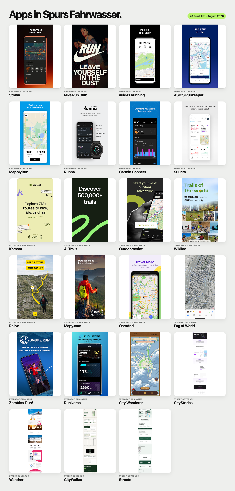

# Design-Referenzen

Diese Sammlung hält visuelle Richtungen fest, ohne daraus bereits Features
oder Produktentscheidungen abzuleiten.

## Nummerierte Routen

Was daran für Spur interessant ist:

- relativ dünne, farbige Linien, die sich deutlich von der Karte abheben
- kompakte runde Stationen mit großen, gut lesbaren Zahlen
- gemeinsame Farbe verbindet Linie und Stationen zu einer Route
- mehrere Routen bleiben durch ihre Farben schnell unterscheidbar

Offen bleibt bewusst, ob und wofür Spur diese Darstellung später verwendet.

## Lauf-, Outdoor- und Erkundungs-Apps

Die [durchklickbare Konkurrenzsammlung](design-references/competitive-apps-2026-08/index.html)
enthält 116 aktuelle Screenshots aus 23 Produkten: große Running-Apps,
Outdoor-Navigation, Bewegungs-Gamification und besonders nahe
Street-Coverage-Angebote. Jede App ist mit ihrer offiziellen Quelle verlinkt.
